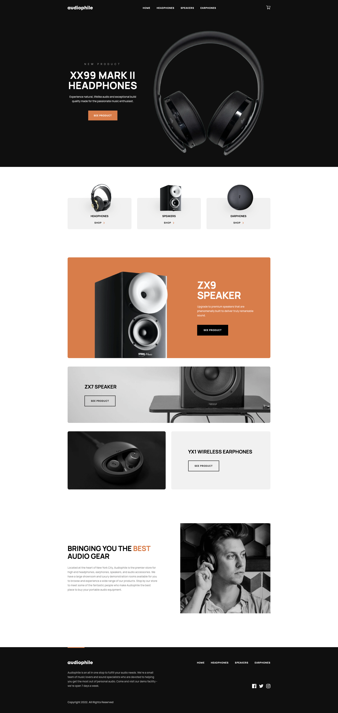

# Audiophile E-Commerce

> A super slick e-commerce to buy your audio hardware!



Audiophile is a online toy project that contains some of the core functionalities that an e-commerce system has:

- Product detail views
- Product lists for each category
- Featured products to highlight on the homepage
- Purchase cart system
- Checkout flow with OTP authentication, address geocoding and credit/debit card payments
- Payment confirmation or failure comms via email

## Built With

This is a Front-end application. The core backend functionality [lives here](https://github.com/mapra99/audiophile-api)

- React
- Remix
- Tailwind
- Context API
- Typescript
- Vite

### Vendors

- Stripe for Payments
- Mapbox.js for maps graphic tools
- Fly.io for app deployment

## Live Demo

[Live Demo Link](https://demo.audiophile.lat/)


## Getting Started

To get a local copy up and running follow these simple example steps.

### Prerequisites

- Node v18+
- NPM

### Setup

1. Clone the project repository
  ```bash
  git@github.com:mapra99/audiophile.git
  ```
2. `cd` into the project folder and install node dependencies
  ```bash
  cd audiophile
  npm install --save-dev
  ```
3. Set up the Backend API following [the instructions here](https://github.com/mapra99/audiophile-api/blob/main/README.md)
4. Create a .env file based on the existing .env.example file_
  ```bash
    cp .env.example .env
  ```
5. Follow the instructions on the .env file regarding the vendors variables that need  to be configured
6. Start the remix server
  ```bash
    npm run dev
  ```

### Usage
Go to http://localhost:3000 and navigate through the site.
If you are going to pay, use `4242 4242 4242 4242` as credit card number to simulate a successful payment.

### Deployment
This app demo site is hosted on Fly.io. Run the following to trigger a deploy
```bash
# This will create a new app called audiophile-stg if it does not exist on your account
flyctl launch --config fly.toml

# This will create a new deploy on the existing audiophile-stg app on your account
flyctl deploy --config fly.toml
```

## Author

**Miguel Prada**

- Github: [@mapra99](https://github.com/mapra99)
- Linkedin: [mprada](https://linkedin.com/in/mprada)

## Contributing

Contributions, issues, and feature requests are welcome!

Feel free to check the [issues page](issues/).

## Show your support

Give a star if you like this project!

## Acknowledgments

- frontendmentor.io for their amazing designs and its community!

## License

This project is [MIT](lic.url) licensed.
